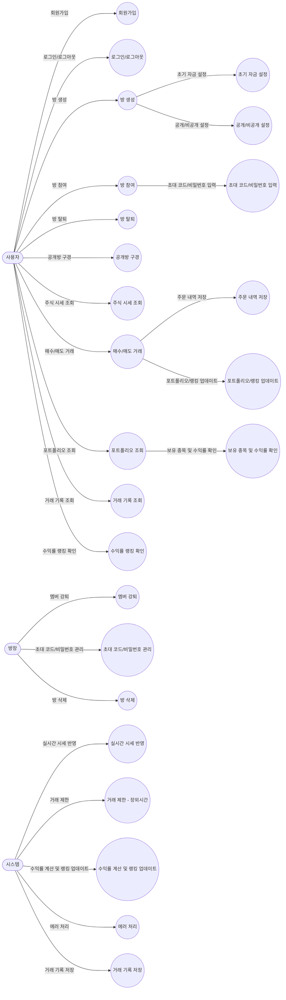

# 📋 **사용자 시나리오 (User Flow)**

## ✅ **1. 비회원 사용자의 흐름**

### 🏠 **[홈페이지]**

- **구성 요소**:
    - 서비스 소개
    - 공개 방 목록 (방 이름, 인원, 수익률 순위 등 표시)
    - 상단 메뉴: 로그인 | 회원가입
    - 공개방 구경하기 (비회원도 가능)

**➡️ 비회원 상태에서 가능한 기능**:

- 공개방의 수익률 랭킹 및 포트폴리오 열람 (거래 불가)
- 회원가입/로그인 이동

---

### 📧 **[회원가입 페이지]**

- **필드**:
    - 아이디 (PK)
        - 중복체크
    - 비밀번호
    - 이름
    - 닉네임
- **회원가입 완료 시**: 로그인 페이지로 이동

---

### 🔐 **[로그인 페이지]**

- **필드**:
    - 아이디
    - 비밀번호
- **성공 시**: 메인 페이지로 이동

---

## ✅ **2. 회원 사용자의 흐름**

### 🏡 **[메인 대시보드 페이지]**

- **구성 요소**:
    - 공개방 목록
        - 방 생성 (버튼)
    - 내 방 목록
        - 진행 중인 방 이름,
        - 수익률 등 표시
    - 내 정보
    - 로그아웃

**➡️ 버튼**:

- 방 생성
- 방 참여
- 방 나가기
- 방 구경하기 (공개방 한정)

---

### 🏗️ **[방 생성 페이지]**

- **필드**:
    - 방 이름
    - 공개/비공개 선택
        - 비공개일 경우: 비밀번호/초대 코드 생성
    - 최대인원
    - 기간(선택사항)
        - 시작일을 선택하고
        - 종료일 설정 - 캘린더 클릭으로 할 수 있게
        - erd 종료일자 - null 가능
        - 종료일자 기준 잔액 유지…. 노업뎃,,
    - 초기 자금 설정 (예: 1,000만 원)

**➡️ 생성 후**: 해당 방의 내부 페이지로 이동

**~~➡️ 리셋기능~~**

**➡️ 종료 후**: 걍 종료 됨. 내 방 리스트에서 조회는 가능

또하고싶음새로파셈

방 상태

- inactive
    - 시작일 이전 방
- active
    - 진행 중
- closed
    - 종료시점 이후 방

---

### 📋 **[방 리스트 페이지]**

- **공개방 목록** (누구나 참여 가능)
- **내가 속한 방 목록** (참여 중인 방)

**➡️ 비공개 방 참여 시**:

- 초대 코드 or 비밀번호 입력 팝업

---

## ✅ **3. 방 내부 흐름 (핵심 기능)**

### 📊 **[방 내부 대시보드]**

- **상단**: 방 이름, 초기 자금, 참여 인원, 나가기 버튼
    - 주식 검색창 (주식 코드, 종목명으로 검색)
- **좌측**:
    - 대시보드
        - 보유 주식, 잔고
    - 거래내역
    - 모의투자
    - 설정
        - 방 탈퇴
- **중앙**:
    - 대시보드
        - 보유 주식, 잔고
        - 포트폴리오 (보유 종목 리스트, 평균 단가, 평가 손익)
    - 거래내역
    - 모의투자
        - 실시간 시세표 (매수/매도 버튼 포함)
    - 설정
- **우측**:
    - 수익률 랭킹 (참여자 별 순위)
    - 실시간 채팅 (방 멤버 간 커뮤니케이션 가능)

**➡️ 버튼**:

- 주식 매수/매도 (장 운영 시간 내에서만 가능)
- 포트폴리오 조회
- 거래 기록 조회

<aside>
✨

방 시스템

- 시작일자 ~ 종료일자
    - 시드 초기화 불가
    - 중도 포기 가능
- 방 연장 또는 다시 시작?
    - 로그를 어떻게 남길 건지
    - 
</aside>

---

### 💸 **[매수/매도 페이지 (팝업형)]**

- **필드**:
    - 주식 코드/종목명
    - 거래 수량
    - 현재가 확인
- **제약 조건**:
    - 거래 시간(09:00~15:30) 외 거래 불가
    - 잔고 부족, 보유 수량 초과 시 에러 발생
- **주문 완료 시**: 포트폴리오 및 랭킹 업데이트

---

### 🧾 **[거래 기록 페이지]**

- **내 거래 내역** (주문/체결 내역 포함)
    - 주문
        - pending
            - 예약주문 가능성
        - canceled
            - 잔액 부족
        - executed
            - 성공
- **필터 기능**:
    - 거래일자
    - 종목명
    - 매수/매도 구분

---

### 💼 **[포트폴리오 페이지]**

- 보유 종목
- 평균 매입가
- 현재가
- 평가 손익
- 수익률

---

### 🏆 **[랭킹 페이지]**

- 참여자들의 수익률 순위
- 실시간 업데이트
- 자신의 순위 강조 표시

---

### ⚙️ **[방장 전용 페이지]**

- 방 정보 수정 (방 이름, 비공개 설정 등)
- 초대 코드/비밀번호 관리
- 멤버 강퇴 기능
- 방 삭제

---

## ✅ **4. 부가 시나리오**

### 📉 **[에러 시나리오]**

1. **장 마감 시간 외 거래 시** → "거래 가능 시간이 아닙니다."
2. **잔고 부족 시** → "잔고가 부족합니다."
3. **보유 수량 초과 매도 시** → "보유 수량을 초과했습니다."
4. **비공개 방 비밀번호 오류 시** → "비밀번호가 틀렸습니다."

---

# 🗂️ **필요한 페이지 목록**

| 페이지 | 설명 |
| --- | --- |
| 홈페이지 | 서비스 소개, 공개방 구경, 로그인/회원가입 버튼 |
| 회원가입 페이지 | 이메일, 비밀번호, 닉네임 입력 |
| 로그인 페이지 | 이메일, 비밀번호 입력 |
| 메인 대시보드 페이지 | 방 목록, 방 생성, 공개 방 구경 |
| 방 생성 페이지 | 방 이름, 공개 여부, 초기 자금 설정 |
| 방 리스트 페이지 | 참여 중인 방 목록 + 공개 방 목록 |
| 방 내부 대시보드 | 거래, 포트폴리오, 랭킹, 채팅 |
| 매수/매도 팝업 | 주식 코드 입력, 수량, 주문 |
| 거래 기록 페이지 | 내 거래 내역 확인 |
| 포트폴리오 페이지 | 보유 종목, 수익률, 평가 손익 |
| 랭킹 페이지 | 방 내 순위 확인 |
| 방장 전용 페이지 | 초대 코드 관리, 멤버 강퇴 |
| 에러 페이지/팝업 | 에러 발생 시 메시지 출력 |

---

