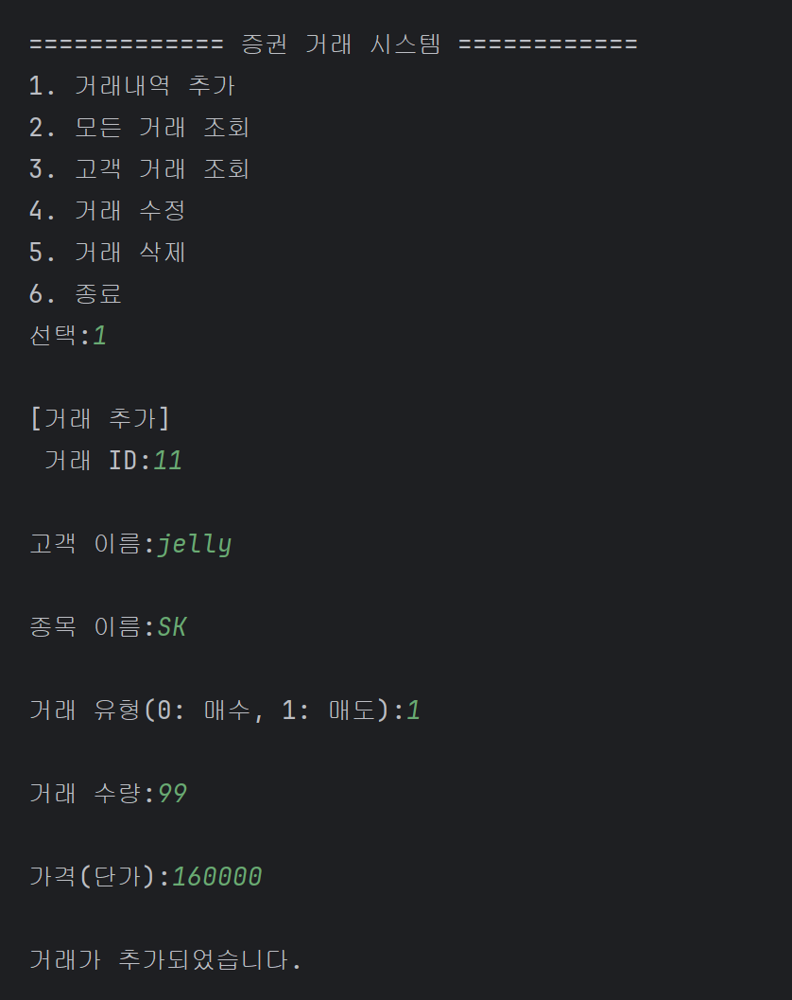
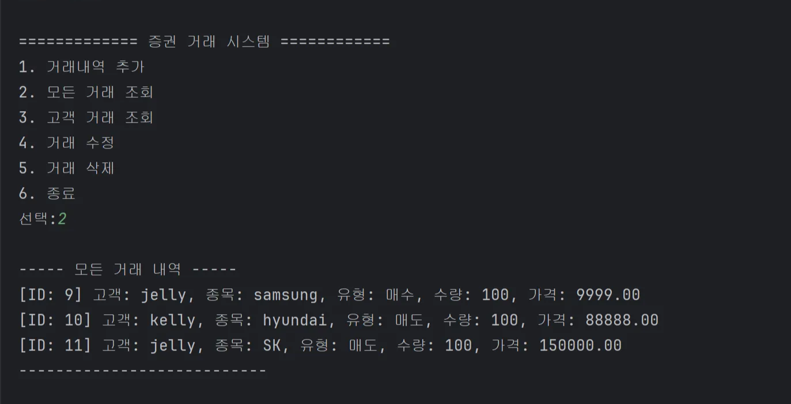

# 복합 문제 실습

Created time: March 25, 2025 9:52 AM

## 코드

### `db.h`

```c
#ifndef DB_H
#define DB_H

#include "transaction.h"

Transaction* db_selectAllTransactions(int* outSize);
int db_updateAllTransactions(const Transaction* transactions, int size);

#endif // DB_H

```

### `db.c`

```c
#include <stdio.h>
#include <stdlib.h>
#include <string.h>
#include <oci.h>   

#include "db.h"
#include "transaction.h"

char* username = "C##...";
char* password = "...."; 
char* dbname = "localhost:1521/xe";
static OCIEnv* envhp;
static OCIError* errhp;
static OCISvcCtx* svchp;
static OCISession* usrhp;
static OCIServer* srvhp;

void check_error(OCIError* errhp) {
    text errbuf[512];
    sb4 errcode = 0;
    OCIErrorGet((dvoid*)errhp, (ub4)1, (text*)NULL, &errcode, errbuf, (ub4)sizeof(errbuf),
        OCI_HTYPE_ERROR);
    printf("Error: %p\n", errbuf);
}

/**
 * @brief   Oracle DB 연결(환경 세팅)
 */
static int db_connect() {
    // 환경 핸들 생성
    if (OCIEnvCreate(&envhp, OCI_DEFAULT, NULL, NULL, NULL, NULL, 0, NULL) !=
        OCI_SUCCESS) {
        printf("OCIEnvCreate failed\n");
        return -1;
        }
    // 오류 핸들 생성
    if (OCIHandleAlloc((dvoid*)envhp, (dvoid**)&errhp, OCI_HTYPE_ERROR, (size_t)0,
        (dvoid**)NULL) != OCI_SUCCESS) {
        printf("OCIHandleAlloc failed for error handle\n");
        return -1;
        }
    // 서버 핸들 생성
    if (OCIHandleAlloc((dvoid*)envhp, (dvoid**)&srvhp, OCI_HTYPE_SERVER, (size_t)0,
        (dvoid**)NULL) != OCI_SUCCESS) {
        printf("OCIHandleAlloc failed for server handle\n");
        return -1;
        }
    // 서버 연결
    if (OCIServerAttach(srvhp, errhp, (text*)dbname, strlen(dbname), OCI_DEFAULT) !=
        OCI_SUCCESS) {
        check_error(errhp);
        return -1;
        }
    // 서비스 컨텍스트 생성
    if (OCIHandleAlloc((dvoid*)envhp, (dvoid**)&svchp, OCI_HTYPE_SVCCTX, (size_t)0,
        (dvoid**)NULL) != OCI_SUCCESS) {
        check_error(errhp);
        return -1;
        }
    // 세션 핸들 생성 및 연결
    if (OCIHandleAlloc((dvoid*)envhp, (dvoid**)&usrhp, OCI_HTYPE_SESSION, (size_t)0,
        (dvoid**)NULL) != OCI_SUCCESS) {
        check_error(errhp);
        return -1;
        }
    if (OCILogon2(envhp, errhp, &svchp,
        (OraText*)username, (ub4)strlen(username),
        (OraText*)password, (ub4)strlen(password),
        (OraText*)dbname, (ub4)strlen(dbname),
        OCI_DEFAULT /* 마지막 인수 추가 */
    ) != OCI_SUCCESS) {
        check_error(errhp);
        return -1;
    }
    printf("Oracle Database connected successfully.\n");
    return 0;
}

/**
 * @brief   Oracle DB 연결 해제(리소스 정리)
 */
static void db_disconnect() {
    OCILogoff(svchp, errhp);
    OCIHandleFree((dvoid*)usrhp, OCI_HTYPE_SESSION);
    OCIHandleFree((dvoid*)svchp, OCI_HTYPE_SVCCTX);
    OCIHandleFree((dvoid*)srvhp, OCI_HTYPE_SERVER);
    OCIHandleFree((dvoid*)errhp, OCI_HTYPE_ERROR);
    OCIHandleFree((dvoid*)envhp, OCI_HTYPE_ENV);
}

/**
 * @brief   TRANSACTIONS 테이블 전체를 SELECT해와서 Transaction 배열로 반환
 *          - CSV 생성 없이 바로 배열에 담음
 */
Transaction* db_selectAllTransactions(int* outSize) {
    *outSize = 0;

    if (db_connect() != 0) {
        fprintf(stderr, "[db_selectAllTransactions] DB 연결 실패\n");
        return NULL;
    }

    OCIStmt *stmt = NULL;
    sword status;

    // SQL: 필요한 컬럼만 SELECT
    const char* sql =
      "SELECT ID, CUSTOMER_NAME, STOCK_NAME, TYPE, AMOUNT, PRICE "
      "FROM TRANSACTIONS "
      "ORDER BY ID";

    OCIHandleAlloc(envhp, (dvoid**)&stmt, OCI_HTYPE_STMT, 0, NULL);
    check_error(errhp);

    // 쿼리 준비
    OCIStmtPrepare(stmt, errhp, (text*)sql, (ub4)strlen(sql),
                            OCI_NTV_SYNTAX, OCI_DEFAULT);
    check_error(errhp);

    // 실행 (배치 페치 고려 시, 여기를 조정)
    OCIStmtExecute(svchp, stmt, errhp, 0, 0, NULL, NULL, OCI_DEFAULT);
    check_error(errhp);

    // Define(출력 바인딩)
    int    id;
    char   customerName[MAX_NAME_LEN];
    char   stockName[MAX_NAME_LEN];
    int    type;
    int    amount;
    double price;

    memset(customerName, 0, sizeof(customerName));
    memset(stockName, 0, sizeof(stockName));

    OCIDefine *def1 = NULL, *def2 = NULL, *def3 = NULL, *def4 = NULL, *def5 = NULL, *def6 = NULL;
    OCIDefineByPos(stmt, &def1, errhp, 1, &id, sizeof(id), SQLT_INT, NULL, NULL, NULL, OCI_DEFAULT);
    OCIDefineByPos(stmt, &def2, errhp, 2, customerName, sizeof(customerName), SQLT_STR, NULL, NULL, NULL, OCI_DEFAULT);
    OCIDefineByPos(stmt, &def3, errhp, 3, stockName, sizeof(stockName), SQLT_STR, NULL, NULL, NULL, OCI_DEFAULT);
    OCIDefineByPos(stmt, &def4, errhp, 4, &type, sizeof(type), SQLT_INT, NULL, NULL, NULL, OCI_DEFAULT);
    OCIDefineByPos(stmt, &def5, errhp, 5, &amount, sizeof(amount), SQLT_INT, NULL, NULL, NULL, OCI_DEFAULT);
    OCIDefineByPos(stmt, &def6, errhp, 6, &price, sizeof(price), SQLT_BDOUBLE, NULL, NULL, NULL, OCI_DEFAULT);

    // 임시 배열
    int capacity = 100;
    Transaction* temp = (Transaction*)malloc(sizeof(Transaction) * capacity);
    if (!temp) {
        fprintf(stderr, "[db_selectAllTransactions] 메모리 할당 실패\n");
        db_disconnect();
        return NULL;
    }
    int count = 0;

    // Fetch
    while ((status = OCIStmtFetch2(stmt, errhp, 1, OCI_FETCH_NEXT, 0, OCI_DEFAULT)) == OCI_SUCCESS) {
        if (count >= capacity) {
            capacity *= 2;
            Transaction* newPtr = (Transaction*)realloc(temp, sizeof(Transaction) * capacity);
            if (!newPtr) {
                fprintf(stderr, "[db_selectAllTransactions] 메모리 재할당 실패\n");
                free(temp);
                db_disconnect();
                return NULL;
            }
            temp = newPtr;
        }
        temp[count].id = id;
        strncpy(temp[count].customerName, customerName, MAX_NAME_LEN - 1);
        strncpy(temp[count].stockName, stockName, MAX_NAME_LEN - 1);
        temp[count].type = type;
        temp[count].amount = amount;
        temp[count].price = price;
        count++;
    }
    // 정상 종료이면 status가 OCI_NO_DATA가 됨
    if (status != OCI_NO_DATA && status != OCI_SUCCESS) {
        check_error(errhp);
    }

    // 자원 해제
    if (stmt) {
        OCIHandleFree(stmt, OCI_HTYPE_STMT);
        stmt = NULL;
    }
    db_disconnect();

    // 정확한 크기의 배열로 복사
    Transaction* finalArray = NULL;
    if (count > 0) {
        finalArray = (Transaction*)malloc(sizeof(Transaction) * count);
        if (finalArray) {
            memcpy(finalArray, temp, sizeof(Transaction) * count);
        }
    }
    free(temp);

    *outSize = count;
    return finalArray;  // DB -> 배열
}

/**
 * @brief   변경된 Transaction 배열을 다시 DB에 반영하는 예시.
 *          (간단히, 테이블 비우고 다시 INSERT하는 방법)
 */
int db_updateAllTransactions(const Transaction* transactions, int size) {
    if (db_connect() != 0) {
        fprintf(stderr, "[db_updateAllTransactions] DB 연결 실패\n");
        return -1;
    }

    // 1) TRANSACTIONS 테이블 비우기 (TRUNCATE)
    {
        OCIStmt *stmt = NULL;

        const char* sqlTrunc = "TRUNCATE TABLE TRANSACTIONS";
        OCIHandleAlloc(envhp, (dvoid**)&stmt, OCI_HTYPE_STMT, 0, NULL);
        check_error(errhp);

        OCIStmtPrepare(stmt, errhp,
                                (text*)sqlTrunc,
                                (ub4)strlen(sqlTrunc),
                                OCI_NTV_SYNTAX, OCI_DEFAULT);
        check_error(errhp);

        OCIStmtExecute(svchp, stmt, errhp, 1, 0, NULL, NULL, OCI_DEFAULT);
        check_error(errhp);

        OCIHandleFree(stmt, OCI_HTYPE_STMT);
    }

    // 2) 배열 내용 INSERT
    for (int i = 0; i < size; i++) {
        OCIStmt *stmt = NULL;
        sword status;
        char sqlInsert[512];

        // 만약 ID가 DB에서 auto-generated identity라면, ID를 넣지 않고
        // (CUSTOMER_NAME, STOCK_NAME, TYPE, AMOUNT, PRICE)만 넣어야 할 수도 있음.
        snprintf(sqlInsert, sizeof(sqlInsert),
         "INSERT INTO TRANSACTIONS (CUSTOMER_NAME, STOCK_NAME, TYPE, AMOUNT, PRICE) "
         "VALUES ('%s', '%s', %d, %d, %.2f)",
         transactions[i].customerName,
         transactions[i].stockName,
         transactions[i].type,
         transactions[i].amount,
         transactions[i].price);

        OCIHandleAlloc(envhp, (dvoid**)&stmt, OCI_HTYPE_STMT, 0, NULL);
        check_error(errhp);

        OCIStmtPrepare(stmt, errhp,
                                (text*)sqlInsert,
                                (ub4)strlen(sqlInsert),
                                OCI_NTV_SYNTAX, OCI_DEFAULT);
        check_error(errhp);

        OCIStmtExecute(svchp, stmt, errhp, 1, 0, NULL, NULL, OCI_DEFAULT);
        check_error(errhp);

        OCIHandleFree(stmt, OCI_HTYPE_STMT);
    }

    // 3) 커밋
    {
        // sword status = OCITransCommit(svchp, errhp, 0);
        OCITransCommit(svchp, errhp, 0);
        check_error(errhp);
    }

    db_disconnect();
    return 0;
}

```

### `transaction.h`

```c
#ifndef TRANSACTION_H
#define TRANSACTION_H

#define MAX_NAME_LEN 50

// 거래 구조체
typedef struct S_Transaction {
    int id;  // 거래 ID
    char customerName[MAX_NAME_LEN];
    char stockName[MAX_NAME_LEN];
    int type;     // 거래 유형 (예: 1=매수, 2=매도 등)
    int amount;   // 거래 수량
    double price; // 거래 단가
} Transaction;

Transaction* loadTransactionsFromCSV(const char* filename, int* outSize);
int saveTransactionsToCSV(const Transaction* transactions, int size, const char* filename);
int saveTransactionsToDat(const Transaction* transactions, int size, const char* filename);
void addTransaction(Transaction** transactions, int* size);
void printAllTransactions(const Transaction* transactions, int size);
void printTransactionsByCustomer(const Transaction* transactions, int size);
void updateTransaction(Transaction* transactions, int size, int id);
void deleteTransaction(Transaction** transactions, int* size, int id);

#endif // TRANSACTION_H

```

### `transaction.c`

```c
#include <stdio.h>
#include <stdlib.h>
#include <string.h>
#include "transaction.h"

Transaction* loadTransactionsFromCSV(const char* filename, int* outSize) {
    FILE* fp = fopen(filename, "r");
    if (!fp) {
        printf("[loadTransactionsFromCSV] CSV 파일 열기 실패: %s\n", filename);
        *outSize = 0;
        return NULL;
    }

    int capacity = 100;
    Transaction* tmpArray = (Transaction*)malloc(capacity * sizeof(Transaction));
    if (!tmpArray) {
        fclose(fp);
        *outSize = 0;
        return NULL;
    }

    int count = 0;
    char buffer[256];

    fgets(buffer, sizeof(buffer), fp); // CSV 헤더 스킵

    while (fgets(buffer, sizeof(buffer), fp)) {
        if (count >= capacity) {
            // capacity를 늘려야 할 경우
            capacity *= 2;
            Transaction* newPtr = (Transaction*)realloc(tmpArray, capacity * sizeof(Transaction));
            if (!newPtr) {
                printf("[loadTransactionsFromCSV] 메모리 재할당 실패\n");
                free(tmpArray);
                fclose(fp);
                *outSize = 0;
                return NULL;
            }
            tmpArray = newPtr;
        }

        Transaction t;
        sscanf(buffer, "%d,%[^,],%[^,],%d,%d,%lf",
               &t.id,
               t.customerName,
               t.stockName,
               &t.type,
               &t.amount,
               &t.price);

        tmpArray[count++] = t;
    }

    fclose(fp);

    // 실제 개수만큼 할당된 새 배열 반환
    Transaction* finalArray = (Transaction*)malloc(count * sizeof(Transaction));
    if (!finalArray) {
        free(tmpArray);
        *outSize = 0;
        return NULL;
    }

    memcpy(finalArray, tmpArray, count * sizeof(Transaction));
    free(tmpArray);

    *outSize = count;
    return finalArray;
}

int saveTransactionsToDat(const Transaction* transactions, int size, const char* filename) {
    FILE* fp = fopen(filename, "wb");  
    if (!fp) {
        fprintf(stderr, "[saveTransactionsToDat] 파일 열기 실패: %s\n", filename);
        return -1;
    }

    size_t written = fwrite(transactions, sizeof(Transaction), size, fp);
    fclose(fp);

    if (written < (size_t)size) {
        fprintf(stderr, "[saveTransactionsToDat] 일부만 쓰기 완료됨. (%zu/%d)\n", written, size);
        return -1;
    }
    return 0; // 성공
}

int saveTransactionsToCSV(const Transaction* transactions, int size, const char* filename) {
    printf("saveTransactionsToCSV called. size=%d, filename=%s\n", size, filename);

    FILE* fp = fopen(filename, "w");
    if (!fp) {
        printf("[saveTransactionsToCSV] CSV 파일 열기 실패: %s\n", filename);
        return -1;
    }

    printf("File opened successfully. Writing CSV header...\n");
    fprintf(fp, "id,customerName,stockName,type,amount,price\n");

    for (int i = 0; i < size; i++) {
        fprintf(fp, "%d,%s,%s,%d,%d,%.2f\n",
                transactions[i].id,
                transactions[i].customerName,
                transactions[i].stockName,
                transactions[i].type,
                transactions[i].amount,
                transactions[i].price);
    }

    fclose(fp);
    printf("CSV written and closed.\n");
    return 0;
}

void addTransaction(Transaction** transactions, int* size) {
    // 거래내역 추가
    Transaction newTrans;
    printf("[거래 추가]\n 거래 ID: ");
    scanf("%d", &newTrans.id);
    printf("고객 이름: ");
    scanf("%s", newTrans.customerName);
    printf("종목 이름: ");
    scanf("%s", newTrans.stockName);
    printf("거래 유형(0: 매수, 1: 매도): ");
    scanf("%d", &newTrans.type);
    printf("거래 수량: ");
    scanf("%d", &newTrans.amount);
    printf("가격(단가): ");
    scanf("%lf", &newTrans.price);
    // 배열 크기 + 1만큼 재할당
    Transaction* newArray = (Transaction*)realloc(*transactions, (*size + 1) * sizeof(Transaction));
    if (!newArray) {
        printf("[addTransaction] 메모리 재할당 실패\n");
        return;
    }
    *transactions = newArray;
    (*transactions)[*size] = newTrans;
    (*size)++;
}

void printAllTransactions(const Transaction* transactions, int size) {
    printf("----- 모든 거래 내역 -----\n");
    for (int i = 0; i < size; i++) {
        printf("[ID: %d] 고객: %s, 종목: %s, 유형: %s, 수량: %d, 가격: %.2f\n",
               transactions[i].id,
               transactions[i].customerName,
               transactions[i].stockName,
               transactions[i].type==0?"매수":"매도",
               transactions[i].amount,
               transactions[i].price);
    }
    printf("---------------------------\n");
}

void printTransactionsByCustomer(const Transaction* transactions, int size) {
    char customerName[MAX_NAME_LEN];
    printf("조회할 고객 이름: ");
    scanf("%s", customerName);

    printf("----- %s 고객의 거래 내역 -----\n", customerName);
    int found = 0;
    for (int i = 0; i < size; i++) {
        if (strcmp(transactions[i].customerName, customerName) == 0) {
            printf("[ID: %d] 종목: %s, 유형: %s, 수량: %d, 가격: %.2f\n",
                   transactions[i].id,
                   transactions[i].stockName,
                   transactions[i].type==0?"매수":"매도",
                   transactions[i].amount,
                   transactions[i].price);
            found = 1;
        }
    }
    if (!found) {
        printf("해당 고객의 거래 내역이 없습니다.\n");
    }
    printf("---------------------------\n");
}

void updateTransaction(Transaction* transactions, int size, int id) {
    for (int i = 0; i < size; i++) {
        if (transactions[i].id == id) {
            printf("[updateTransaction] 거래 ID=%d 내역을 수정합니다.\n", id);
            printf("새로운 고객 이름: ");
            scanf("%s", transactions[i].customerName);
            printf("새로운 종목 이름: ");
            scanf("%s", transactions[i].stockName);
            printf("새로운 거래 유형(숫자): ");
            scanf("%d", &transactions[i].type);
            printf("새로운 수량: ");
            scanf("%d", &transactions[i].amount);
            printf("새로운 가격: ");
            scanf("%lf", &transactions[i].price);
            printf("수정 완료!\n");
            return;
        }
    }
    printf("[updateTransaction] 해당 ID(%d)를 찾을 수 없습니다.\n", id);
}

void deleteTransaction(Transaction** transactions, int* size, int id) {
    int index = -1;
    for (int i = 0; i < *size; i++) {
        if ((*transactions)[i].id == id) {
            index = i;
            break;
        }
    }
    if (index == -1) {
        printf("[deleteTransaction] 해당 ID(%d)를 찾을 수 없습니다.\n", id);
        return;
    }

    for (int i = index; i < (*size) - 1; i++) {
        (*transactions)[i] = (*transactions)[i + 1];
    }

    Transaction* newArray = (Transaction*)realloc(*transactions, (*size - 1) * sizeof(Transaction));
    if (!newArray && (*size - 1) > 0) {
        printf("[deleteTransaction] 메모리 재할당 실패\n");
        (*size)--;
        return;
    }

    *transactions = newArray;
    (*size)--;
    printf("[deleteTransaction] 거래 ID %d 삭제 완료.\n", id);
}

```

### `main.c`

```c
#include <stdio.h>
#include <stdlib.h>
#include "db.h"
#include "transaction.h"

int main() {
    int choice;
    int size = 0;
    Transaction* transactions = NULL;

    transactions = db_selectAllTransactions(&size);
    if (!transactions) {
        printf("DB(파일)에서 거래 내역을 불러오지 못했습니다. 새로 시작합니다.\n");
        size = 0;
    }

    while (1) {
        printf("\n============= 증권 거래 시스템 ============\n");
        printf("1. 거래내역 추가\n");
        printf("2. 모든 거래 조회\n");
        printf("3. 고객 거래 조회\n");
        printf("4. 거래 수정\n");
        printf("5. 거래 삭제\n");
        printf("6. 종료\n");
        printf("선택: ");
        scanf("%d", &choice);

        switch (choice) {
            case 1:
                addTransaction(&transactions, &size);
            printf("거래가 추가되었습니다.\n");
            break;
            case 2:
                printAllTransactions(transactions, size);
            break;
            case 3:
                printTransactionsByCustomer(transactions, size);
            break;
            case 4:
                int updateID;
                printf("수정할 거래 ID: ");
                scanf("%d", &updateID);
                updateTransaction(transactions, size, updateID);
            break;
            case 5:
                int deleteID;
                printf("삭제할 거래 ID: ");
                scanf("%d", &deleteID);
            deleteTransaction(&transactions, &size, deleteID);
            break;
            case 6:
                // 종료 전, CSV(DB)에 최종 저장
                    if (db_updateAllTransactions(transactions, size) == 0) {
                        printf("변경사항을 DB에 성공적으로 저장했습니다.\n");
                    } else {
                        printf("DB에 저장하는 데 실패했습니다.\n");
                    }
                    if (saveTransactionsToCSV(transactions, size, "C:/CLangStudy/Day14/module4/transactions.csv") == 0) {
                        printf("CSV 파일로 성공적으로 저장했습니다.\n");
                    } else {
                        printf("CSV 저장 실패!\n");
                    }
                    if (saveTransactionsToDat(transactions, size, "C:/CLangStudy/Day14/module4/stock.dat") == 0) {
                        printf("이진 파일로 성공적으로 저장했습니다.\n");
                    } else {
                        printf("이진 파일 저장 실패!\n");
                    }
            printf("프로그램을 종료합니다.\n");
            free(transactions);
            return 0;
            
            default:
                printf("잘못된 선택입니다. 다시 입력해주세요.\n");

        }
    }

}

```

### SQL

```sql
create table TRANSACTIONS
(
    ID            NUMBER generated as identity
        constraint PK_TRANSACTIONS
            primary key,
    CUSTOMER_NAME VARCHAR2(100) not null,
    STOCK_NAME    VARCHAR2(100) not null,
    TYPE          NUMBER(3)     not null,
    AMOUNT        NUMBER(10)    not null,
    PRICE         NUMBER(14, 2) not null
)
```

## 실행결과

### 1. 거래내역 추가



### 2. 모든 거래 조회

- DB에서 불러온 기존 거래내역도 확인 가능 (ID: 9, 10)



### 3. 고객 거래 조회


### 4. 거래 수정


### 5. 거래 삭제


### 6. 종료

- DB에 거래 내역 업데이트
- CSV 파일 생성


